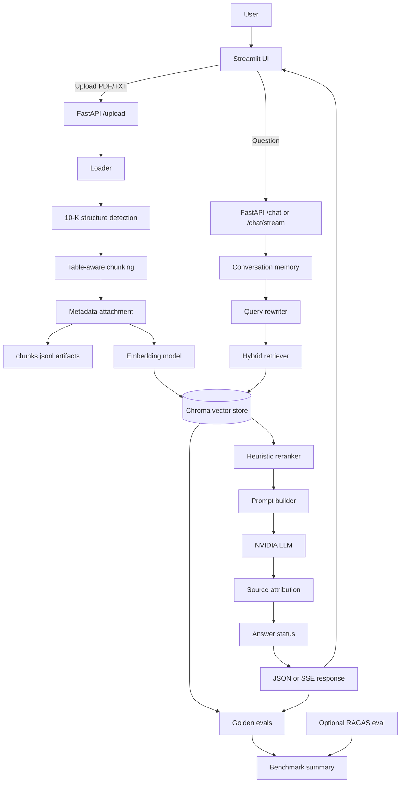

# FinDocAI — Financial Document RAG Assistant

A learning-focused MVP for question answering over SEC 10-K financial reports using RAG, hybrid retrieval, reranking, source attribution, conversation memory, streaming UI, and evaluation benchmarks.

This project is for educational and research use only. It does not provide investment advice, recommendations, or buy/sell/hold decisions.

## 1. Project Scope

FinDocAI is an MVP for document-grounded question answering over financial reports. The main target document type is SEC 10-K reports, where the system can ingest a filing, chunk it with 10-K structure awareness, index it into Chroma, retrieve relevant evidence, and generate grounded answers with citations.

The goal is not to replace ChatGPT, financial research platforms, or professional analysis tools. The goal is to demonstrate an end-to-end financial RAG pipeline that is inspectable, testable, and suitable for learning or portfolio review.

FinDocAI is not production-ready and is not a financial advisor.

## 2. Key Features

- PDF/TXT upload.
- 10-K-aware document processing.
- SEC item and section detection.
- Table-aware chunking with heuristic table context/header carry-forward.
- `chunks.jsonl` artifact generation.
- Chroma vector indexing.
- `sentence-transformers` embeddings.
- Vector, keyword, and hybrid retrieval.
- Heuristic reranking.
- NVIDIA LLM through an OpenAI-compatible API.
- Grounded prompt guardrails.
- `answer_status` values:
  - `answered`
  - `insufficient_context`
  - `unverified_sources`
- Source attribution policy:
  - `retrieved_context != sources`
  - `sources` only come from valid `[Source N]` citations.
- Conversation memory.
- Query rewriting for follow-up questions.
- `/chat` and `/chat/stream` APIs.
- Streamlit UI with User Mode and Developer Mode.
- Typewriter-like streaming UI.
- Golden chunking, retriever, and answer eval.
- Optional RAGAS benchmark.
- Benchmark summary markdown report.

## 3. End-to-End System Architecture

FinDocAI has one end-to-end RAG flow with three connected paths.

Upload / indexing path:

```text
User
-> Streamlit UI
-> FastAPI /upload
-> Loader
-> 10-K structure detection
-> Table-aware chunking
-> Metadata attachment
-> chunks.jsonl
-> Embedding model
-> Chroma vector store
```

Chat / answering path:

```text
User question
-> Streamlit UI
-> FastAPI /chat or /chat/stream
-> Conversation memory
-> Query rewriter
-> Hybrid retriever
-> Vector + keyword retrieval from Chroma
-> Heuristic reranker
-> Prompt builder
-> NVIDIA LLM
-> Source attribution
-> Answer status
-> JSON or SSE response
-> Streamlit UI
```

Evaluation path:

```text
Golden chunking eval
+ Golden retriever eval
+ Golden answer eval
+ Optional RAGAS eval
-> Benchmark summary
```



<!-- Optional: add system architecture image here, e.g. docs/assets/system_architecture.png -->

## 4. Source Attribution Policy

FinDocAI separates retrieval context from supporting sources:

- `retrieved_context` is the top-k context sent to the LLM. It is mainly for debugging and Developer Mode.
- `sources` contains only chunks explicitly cited by the answer using valid `[Source N]` citations.
- If the answer says there is insufficient context:
  - `answer_status = "insufficient_context"`
  - `sources = []`
- If the answer makes claims but has no valid citation:
  - `answer_status = "unverified_sources"`
  - `sources = []`
- `source_number` is preserved, so an answer citation such as `[Source 3]` renders as `Source 3` in the UI.
- User Mode only displays supporting sources.
- Developer Mode may show `retrieved_context` as related retrieved passages.

Example:

```json
{
  "answer_status": "insufficient_context",
  "sources": []
}
```

## 5. Conversation Memory & Query Rewriting

Conversation memory is in-memory per `session_id`.

- `use_memory=true` allows recent turns to be included in the answer prompt.
- `use_memory_for_retrieval=false` by default. This prevents unrelated previous questions from polluting retrieval for a new standalone question.
- For follow-up questions such as `How about Services?`, the system can rewrite the query into a standalone retrieval query when memory retrieval is enabled.
- Query rewriting is heuristic-first, with optional LLM fallback.
- This is useful for the demo, but it is not a production-grade conversational planner.

Example:

```text
Previous question:
What was Apple's gross margin percentage in 2023?

Follow-up:
How about Services?

Rewritten retrieval query:
What was Apple's Services gross margin percentage in 2023?
```

## 6. Table Handling

FinDocAI includes table-aware chunking and table context enrichment. It attempts to keep table headers and year columns connected with split table rows, which helps answer questions such as:

```text
What was Apple's gross margin percentage in 2023?
```

The table handling is heuristic. It is useful for selected MVP benchmark cases, but it is not production-grade and should be evaluated on more filings before relying on it for broad table QA.

## 7. Setup

PowerShell:

```powershell
cd <repo>
python -m venv .venv
.\.venv\Scripts\Activate.ps1
python -m pip install -r requirements.txt
```

Create or update `.env`:

```env
LLM_PROVIDER=nvidia
NVIDIA_API_KEY=your_nvidia_api_key_here
NVIDIA_BASE_URL=https://integrate.api.nvidia.com/v1
NVIDIA_MODEL=deepseek-ai/deepseek-v4-flash
NVIDIA_TEMPERATURE=0.2
NVIDIA_TOP_P=0.95
NVIDIA_MAX_TOKENS=4096
NVIDIA_REASONING_ENABLED=false
NVIDIA_REASONING_EFFORT=high

EMBEDDING_PROVIDER=sentence_transformers
EMBEDDING_MODEL=sentence-transformers/all-MiniLM-L6-v2
CHROMA_PERSIST_DIR=data/chroma

RAG_MAX_CHARS_PER_CHUNK=1800
RAG_MAX_TOTAL_CONTEXT_CHARS=12000
RERANK_ENABLED=true
RERANK_TOP_K=5
```

The first embedding/indexing run may download the `sentence-transformers` model.

## 8. Run the MVP Demo

Start the backend:

```powershell
uvicorn app.main:app --reload --host 127.0.0.1 --port 8000
```

Start Streamlit:

```powershell
streamlit run frontend/streamlit_app.py
```

Demo workflow:

1. Open the Streamlit UI.
2. Upload a 10-K PDF or TXT.
3. Click `Process document`.
4. Wait until the document is ready.
5. Ask questions in chat.
6. Inspect the answer and sources.
7. Turn on Developer Mode to inspect raw JSON, retrieved context, and benchmark reports.

## 9. API Endpoints

| Method | Endpoint | Purpose |
| --- | --- | --- |
| `GET` | `/health` | Health check |
| `POST` | `/upload` | Upload, chunk, evaluate chunks, and optionally index into Chroma |
| `POST` | `/retrieve` | Debug retrieval with vector, keyword, hybrid, and reranking options |
| `POST` | `/chat` | Non-streaming RAG answer generation |
| `POST` | `/chat/stream` | Streaming RAG answer generation as Server-Sent Events |
| `GET` | `/chat/sessions/{session_id}` | Read recent in-memory chat history |
| `DELETE` | `/chat/sessions/{session_id}` | Clear in-memory chat history |

Upload:

```powershell
curl.exe -X POST "http://127.0.0.1:8000/upload" `
  -F "file=@path\to\NASDAQ_AAPL_2023.pdf" `
  -F "index_to_chroma=true"
```

Chat:

```powershell
$body = @{
  question = "What were Apple's total net sales and net income in 2023?"
  collection_name = "findoc_nasdaq_aapl_2023"
  retrieval_mode = "hybrid"
  rerank = $true
  top_k = 5
  candidate_k = 20
  session_id = "demo-session"
  use_memory = $true
  use_memory_for_retrieval = $false
} | ConvertTo-Json -Compress

Invoke-RestMethod `
  -Uri "http://127.0.0.1:8000/chat" `
  -Method Post `
  -ContentType "application/json" `
  -Body $body
```

Streaming:

```powershell
curl.exe -N -X POST "http://127.0.0.1:8000/chat/stream" `
  -H "Content-Type: application/json" `
  -d "{\"question\":\"What were Apple's total net sales and net income in 2023?\",\"collection_name\":\"findoc_nasdaq_aapl_2023\",\"retrieval_mode\":\"hybrid\",\"rerank\":true,\"top_k\":5,\"candidate_k\":20}"
```

## 10. Retrieval Modes

- `vector`: semantic search using embeddings and Chroma.
- `keyword`: deterministic term matching over stored chunks.
- `hybrid`: merges vector and keyword candidates.
- `reranking`: heuristic reranker boosts relevant sections and tables based on query terms and metadata.

## 11. Benchmarking

FinDocAI has two benchmark layers.

### A. FinDocAI Golden Benchmark

The domain-specific benchmark checks:

- chunk quality
- retriever hit/source behavior
- `answer_status`
- citations
- cited source sections
- insufficient context behavior
- expected terms
- forbidden terms
- multi-turn query rewriting

### B. Optional RAGAS Benchmark

The optional RAGAS benchmark can evaluate:

- faithfulness
- answer relevancy
- context precision
- context recall
- answer correctness

RAGAS is optional and may require evaluator model configuration depending on the installed RAGAS version.

Run benchmark commands:

```powershell
python -m app.rag.eval.chunking_eval --cases tests/golden/chunking_cases.json --output data/eval/chunking_golden_report.json

python -m app.rag.eval.retriever_eval --cases tests/golden/retriever_cases.json --output data/eval/retriever_golden_report.json

$env:RUN_LLM_EVAL="1"
python -m app.rag.eval.answer_eval --cases tests/golden/answer_cases.json --output data/eval/answer_golden_report.json

pip install -r requirements-eval.txt
$env:RUN_RAGAS_EVAL="1"
python -m app.rag.eval.ragas_eval --cases tests/golden/ragas_cases.json --output data/eval/ragas_report.json

python -m app.rag.eval.benchmark_summary --output data/eval/benchmark_summary.md
```

If `RUN_LLM_EVAL` or `RUN_RAGAS_EVAL` is not set, live evals are skipped intentionally.

## 12. Example Questions

- What were Apple's total net sales and net income in 2023?
- Why did Apple's total net sales decrease in 2023 compared to 2022?
- Which product categories increased or decreased in 2023?
- What was Apple's gross margin percentage in 2023?
- What was Apple's Services gross margin percentage in 2023?
- What was the weighted-average interest rate of Apple's commercial paper as of September 30, 2023?
- What was Apple's weighted average interest rate in 2024?

The 2024 interest rate question should return insufficient context when asking against the 2023 filing, because that filing does not contain the 2024 information.

## 13. Tests

Run all tests:

```powershell
pytest
```

Run targeted benchmark tests:

```powershell
pytest tests/test_answer_golden_eval.py tests/test_ragas_eval.py tests/test_benchmark_summary.py
```

Unit tests do not call NVIDIA or RAGAS live by default.

## 14. Project Structure

| Path | Purpose |
| --- | --- |
| `app/api` | FastAPI routes for upload, retrieval, and chat |
| `app/core` | Runtime configuration |
| `app/rag` | RAG pipeline modules: chunking, vector store, retrieval, reranking, prompting, memory, answer service |
| `app/rag/eval` | Golden eval, optional RAGAS eval, and benchmark summary runners |
| `frontend` | Streamlit UI |
| `tests/golden` | Golden benchmark case files |
| `docs` | Project documentation, including MVP freeze notes |
| `data/eval` | Generated benchmark reports and summaries |

## 15. MVP v0.1 Freeze

See [docs/MVP_FREEZE.md](docs/MVP_FREEZE.md).

MVP v0.1 freezes the current feature set. After this point, the focus is benchmarking, bug fixing, documentation, and demo readiness. Large features such as agents, MLOps, deployment, and authentication are not part of this MVP phase.

## 16. Known Limitations

- Table extraction is heuristic and not production-grade.
- Table QA works for selected benchmark cases but needs larger evaluation.
- Query rewriting is heuristic-first and not a full conversational planner.
- Conversation memory is in-memory only.
- The benchmark set is still small.
- RAGAS is optional and may require additional evaluator configuration.
- No MLOps or MLflow integration.
- No deployment layer.
- No authentication or user management.
- Not investment advice.

## 17. Roadmap

- Structured table extraction.
- Larger benchmark dataset across more filings.
- More robust answer validation.
- Multi-document comparison.
- Persistent memory/database.
- MLOps and monitoring.
- Deployment.
- Optional tool-augmented financial QA.
