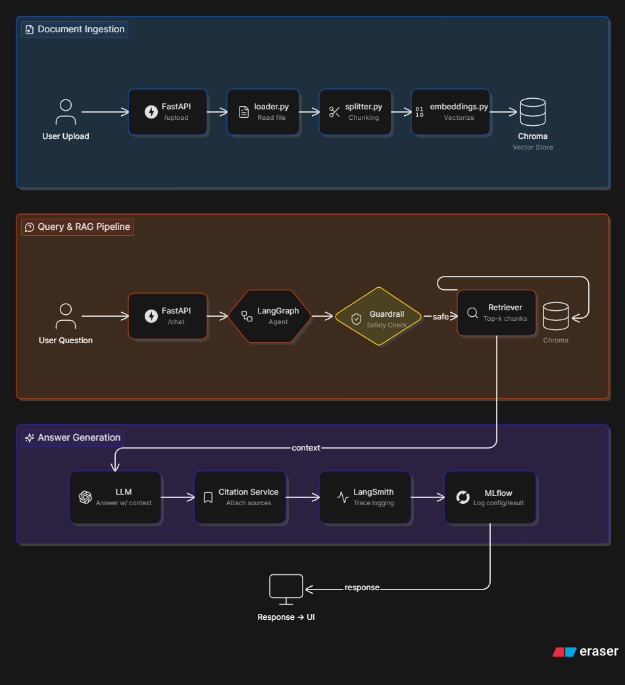

# FinDocGPT — Finance AI Assistant

FinDocGPT is a lightweight **Finance AI Assistant** for reading and analyzing financial documents such as annual reports, financial statements, earnings reports, and business reports.

The goal of this project is to build a small but real **LLM application** that includes:

- Document ingestion
- RAG — Retrieval-Augmented Generation
- LangGraph agent workflow
- Chroma vector store
- Citation-based answers
- Financial guardrails
- LangSmith tracing
- MLflow logging
- RAGAS evaluation
- FastAPI backend
- Streamlit frontend
- Docker, CI, security scan, and monitoring basics

> This project is for learning and research purposes only. It does **not** provide investment advice, stock recommendations, or buy/sell/hold decisions.

---

## 1. Target User

The target user is a:

> **Junior financial analyst / investment research intern**

This user needs to read long financial documents, extract useful information, ask questions, calculate financial ratios, and prepare short analyst-style summaries.

FinDocGPT helps the user:

- Upload financial PDF/TXT documents
- Ask questions about the uploaded documents
- Get answers grounded in document context
- View source citations
- Generate short financial summaries
- Avoid unsupported financial advice

---

## 2. Problem Statement

Financial analysts often spend a lot of time reading long reports and manually extracting key information such as:

- Revenue drivers
- Business performance
- Risk factors
- Management discussion
- Financial metrics
- Important events and uncertainties

This process is repetitive, slow, and easy to miss details.

FinDocGPT solves this by using an LLM-powered RAG pipeline to help users search, summarize, and reason over financial documents with citations.

---

## 3. System Architecture

The system is divided into three main flows:

1. **Document Ingestion**
2. **Query & RAG Pipeline**
3. **Answer Generation**

---

## 4. General Flow

---

## 5. Layered Architecture

| Layer | Responsibility | Main Files |
|---|---|---|
| Frontend Layer | User interface for upload, chat, report generation | `frontend/streamlit_app.py` |
| API Layer | FastAPI endpoints | `app/main.py`, `app/api/*.py` |
| Core Layer | Config, security, logging, rate limiting | `app/core/*.py` |
| Schema Layer | Request/response models | `app/schemas/*.py` |
| Service Layer | Business logic orchestration | `app/services/*.py` |
| Agent Layer | LangGraph workflow and tools | `app/agent/*.py` |
| RAG Layer | Loading, splitting, embedding, retrieval | `app/rag/*.py` |
| Data Layer | Raw files, processed chunks, Chroma DB | `data/raw`, `data/processed`, `data/chroma` |
| Evaluation / LLMOps Layer | RAGAS, LangSmith, MLflow logging | `evals/*`, `app/services/eval_logger.py` |
| DevOps / Monitoring Layer | Docker, GitHub Actions, Prometheus, Grafana | `Dockerfile`, `docker-compose.yml`, `.github/workflows/*`, `monitoring/*` |

---

## 6. Main Features

### Document Ingestion

- Upload PDF/TXT files
- Read document content
- Split content into chunks
- Convert chunks into embeddings
- Store embeddings and metadata in Chroma

### RAG Chat

- Ask questions about uploaded documents
- Retrieve top-k relevant chunks
- Generate answers using LLM
- Return answer with citations

### LangGraph Agent

The agent workflow includes:

```text
START
↓
guardrail_node
↓
retrieve_node
↓
tool_node
↓
generate_node
↓
citation_node
↓
END
```

### Financial Tools

The assistant may call simple financial calculation tools:

- `calculate_revenue_growth`
- `calculate_gross_margin`
- `calculate_operating_margin`
- `calculate_net_margin`

### Guardrails

The system should block or redirect:

- Direct investment advice
- Buy/sell/hold recommendations
- Certain price prediction requests
- Prompt injection attempts
- Requests to reveal API keys or system prompts

Example safe response:

```text
I can analyze the information in the provided financial documents, but I cannot provide personal investment advice or buy/sell recommendations.
```

---

## 7. Tech Stack

| Layer | Technology |
|---|---|
| Backend | FastAPI |
| Frontend | Streamlit |
| LLM | Gemini / OpenAI / Groq |
| RAG Framework | LangChain |
| Agent Framework | LangGraph |
| Vector Store | Chroma |
| Embedding | sentence-transformers or provider embedding API |
| Tracing | LangSmith |
| Logging / Experiments | MLflow |
| Evaluation | RAGAS |
| Security | API key, rate limit, Bandit, pip-audit, Trivy |
| Deployment | Docker Compose |
| Monitoring | Prometheus + Grafana |

---

## 8. Project Structure

```text
findocgpt/
├── app/
│   ├── main.py
│   ├── api/
│   │   ├── routes_chat.py
│   │   ├── routes_upload.py
│   │   ├── routes_report.py
│   │   ├── routes_health.py
│   │   └── routes_metrics.py
│   │
│   ├── core/
│   │   ├── config.py
│   │   ├── security.py
│   │   ├── logging.py
│   │   └── rate_limit.py
│   │
│   ├── rag/
│   │   ├── loader.py
│   │   ├── splitter.py
│   │   ├── embeddings.py
│   │   ├── vector_store.py
│   │   ├── retriever.py
│   │   └── prompts.py
│   │
│   ├── agent/
│   │   ├── graph.py
│   │   ├── state.py
│   │   ├── nodes.py
│   │   └── tools.py
│   │
│   ├── services/
│   │   ├── chat_service.py
│   │   ├── report_service.py
│   │   ├── citation_service.py
│   │   ├── guardrail_service.py
│   │   └── eval_logger.py
│   │
│   └── schemas/
│       ├── chat.py
│       ├── upload.py
│       ├── report.py
│       └── common.py
│
├── frontend/
│   └── streamlit_app.py
│
├── evals/
│   ├── golden_questions.json
│   ├── run_ragas_eval.py
│   └── sample_eval_output.json
│
├── data/
│   ├── raw/
│   ├── processed/
│   └── chroma/
│
├── tests/
│   ├── test_splitter.py
│   ├── test_financial_tools.py
│   ├── test_guardrails.py
│   ├── test_chat_api.py
│   └── test_upload_api.py
│
├── monitoring/
│   ├── prometheus.yml
│   └── grafana-dashboard.json
│
├── .github/
│   └── workflows/
│       ├── ci.yml
│       └── security.yml
│
├── Dockerfile
├── docker-compose.yml
├── requirements.txt
├── .env.example
├── README.md
├── SECURITY.md
└── Makefile
```

---

## 9. API Endpoints

| Method | Endpoint | Description |
|---|---|---|
| `GET` | `/health` | Check API health |
| `GET` | `/metrics` | Expose Prometheus metrics |
| `POST` | `/upload` | Upload and index a financial document |
| `POST` | `/chat` | Ask a question about uploaded documents |
| `POST` | `/report` | Generate an analyst-style summary |
| `POST` | `/eval/run` | Run evaluation if implemented as API |

---

## 10. Example Chat Response

```json
{
  "answer": "The company reports that revenue growth was mainly driven by product sales and service expansion...",
  "sources": [
    {
      "file_name": "annual_report.pdf",
      "page": 12,
      "chunk_id": "chunk_001"
    }
  ],
  "used_tools": [],
  "confidence": 0.82
}
```

---

## 11. Environment Variables

Create a `.env` file based on `.env.example`.

```env
APP_NAME=FinDocGPT
ENV=development

# LLM provider — nhà cung cấp mô hình ngôn ngữ lớn
LLM_PROVIDER=nvidia

# NVIDIA API configuration
NVIDIA_API_KEY=your_nvidia_api_key_here
NVIDIA_BASE_URL=https://integrate.api.nvidia.com/v1
NVIDIA_MODEL=deepseek-ai/deepseek-v4-flash

# LLM generation settings — cấu hình sinh câu trả lời
NVIDIA_TEMPERATURE=1
NVIDIA_TOP_P=0.95
NVIDIA_MAX_TOKENS=16384

# Reasoning settings — cấu hình suy luận nếu model hỗ trợ
NVIDIA_REASONING_ENABLED=true
NVIDIA_REASONING_EFFORT=high

# Embedding provider — mô hình tạo vector cho RAG
EMBEDDING_PROVIDER=sentence_transformers
EMBEDDING_MODEL=sentence-transformers/all-MiniLM-L6-v2

# Optional alternative providers
# GEMINI_API_KEY=your_gemini_key_here
# GROQ_API_KEY=your_groq_key_here
# OPENAI_API_KEY=your_openai_key_here

# Vector database — nơi lưu vector/chunk
CHROMA_PERSIST_DIR=data/chroma

# API security — bảo mật API nội bộ của app
API_KEY=dev-secret-key
RATE_LIMIT_PER_MINUTE=30

# LangSmith tracing — theo dõi trace/dấu vết chạy của LangChain/LangGraph
LANGCHAIN_TRACING_V2=true
LANGCHAIN_API_KEY=your_langsmith_key_here
LANGCHAIN_PROJECT=findocgpt-dev

# MLflow tracking — lưu config/result/evaluation
MLFLOW_TRACKING_URI=http://localhost:5000
```

---

## 12. Local Setup

### 1. Clone repository

```bash
git clone <your-repo-url>
cd findocgpt
```

### 2. Create virtual environment

```bash
python -m venv .venv
```

Activate on Windows PowerShell:

```bash
.\.venv\Scripts\Activate.ps1
```

Activate on macOS/Linux:

```bash
source .venv/bin/activate
```

### 3. Install dependencies

```bash
pip install -r requirements.txt
```

### 4. Run FastAPI backend

```bash
uvicorn app.main:app --reload
```

### 5. Run Streamlit frontend

```bash
streamlit run frontend/streamlit_app.py
```

---

## 13. Docker Compose

Run the system with Docker Compose:

```bash
docker compose up --build
```

Expected services:

- FastAPI backend
- Streamlit frontend
- MLflow
- Prometheus
- Grafana

---

## 14. Evaluation

RAG evaluation is handled by RAGAS.

Example evaluation flow:

```text
evals/golden_questions.json
↓
evals/run_ragas_eval.py
↓
chat_service.py
↓
RAGAS metrics
↓
MLflow logging
↓
evals/sample_eval_output.json
```

Main metrics:

| Metric | Meaning |
|---|---|
| Faithfulness | Whether the answer is grounded in retrieved context |
| Answer Relevancy | Whether the answer addresses the question |
| Context Precision | Whether retrieved chunks are relevant |
| Context Recall | Whether enough relevant context is retrieved |

Run evaluation:

```bash
python evals/run_ragas_eval.py
```

---

## 15. Security

Security checks include:

- API key validation
- Rate limiting
- Input validation
- File type validation
- No `.env` commit
- Bandit for Python security scan
- pip-audit for dependency vulnerability scan
- Trivy for filesystem/container scan

Run basic security checks:

```bash
bandit -r app
pip-audit -r requirements.txt
trivy fs .
```

---

## 16. Monitoring

Monitoring is handled by Prometheus and Grafana.

The backend exposes:

```text
GET /metrics
```

Prometheus config:

```text
monitoring/prometheus.yml
```

Grafana dashboard:

```text
monitoring/grafana-dashboard.json
```

Basic metrics:

- Request count
- Request latency
- Error count
- Chat endpoint latency
- Upload endpoint count

---

## 17. CI/CD

GitHub Actions workflows:

```text
.github/workflows/ci.yml
.github/workflows/security.yml
```

### CI workflow

Expected tasks:

- Install dependencies
- Run lint
- Run tests
- Build Docker image

### Security workflow

Expected tasks:

- Bandit scan
- pip-audit scan
- Trivy filesystem scan
- Trivy image scan

---

## 18. Current MVP Scope

The MVP focuses on:

- Upload PDF/TXT
- Parse and chunk document
- Store embeddings in Chroma
- Ask questions using RAG
- Generate answers with citations
- Use LangGraph agent flow
- Apply financial guardrails
- Log traces with LangSmith
- Log evaluation results with MLflow
- Run RAGAS evaluation
- Provide Docker and CI/security basics

---

## 19. Out of Scope for MVP

The following features are not included in the first MVP:

- Real-time stock price prediction
- Buy/sell/hold recommendations
- Full SEC EDGAR integration
- React frontend
- Multi-user authentication
- Kubernetes deployment
- Fine-tuning LLMs
- Multi-agent research workflow

---

## 20. Roadmap

### Phase 1 — MVP

- Upload documents
- RAG chat with citations
- LangGraph agent
- Financial guardrails
- Streamlit UI

### Phase 2 — LLMOps

- RAGAS evaluation
- LangSmith tracing
- MLflow experiment logging
- More test cases

### Phase 3 — Production Improvements

- Better authentication
- Better document parser
- SEC EDGAR API integration
- Better observability dashboard
- Cloud deployment

---

## 21. Disclaimer

This project is for educational and research purposes only.

FinDocGPT does not provide financial advice, investment recommendations, or predictions of future stock prices. Users should verify all information from original financial documents and consult qualified professionals before making financial decisions.
